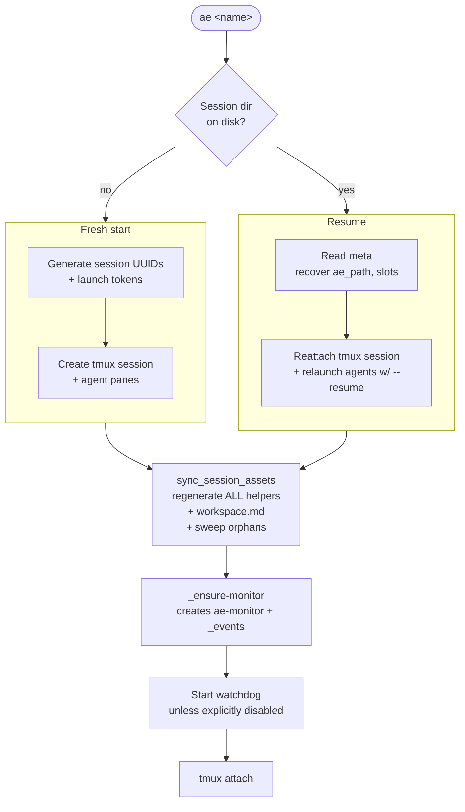

# Architecture

ae is intentionally simple. The entire tool fits in one bash script. Understanding it in a single sitting is the design goal.

## Mental model

```mermaid
flowchart LR
    User[You] -->|ae start/resume| AE[ae bash script]
    AE --> Cfg[~/.ae/config<br/>INI parser]
    AE --> Tmux[(tmux session)]
    AE --> SessDir[~/.ae/sessions/&lt;name&gt;/<br/>helpers + meta + events.jsonl]
    Tmux --> AgentPane1[claude:lead pane]
    Tmux --> AgentPane2[codex:coworker pane]
    Tmux --> Monitor[ae-monitor window]
    Monitor --> Watchdog[_watchdog pane<br/>watchdog]
    Monitor --> Events[_events pane<br/>events-tail]
    AgentPane1 -.send/ask/reply.-> SessDir
    AgentPane2 -.send/ask/reply.-> SessDir
    Watchdog -.reads events.jsonl.-> SessDir
    Events -.tails events.jsonl.-> SessDir
```

## Session lifecycle — start vs resume

The same `ae <name>` command handles both first creation and reattach. The only branch is whether a session directory already exists on disk; everything downstream is shared.



The regenerate step is unconditional on both paths — that's how upgrades propagate without any migration ceremony.

## Single bash script

The `ae` script does everything: config parsing, tmux orchestration, helper generation, session state management. No build step, no runtime, no plugin framework. The file index near the top of the script groups functions by concern (Config, Helpers, Resume, Session, Launch, Manifest, Commands).

## Per-session state on disk

When you start a session, ae creates `~/.ae/sessions/<name>/` and fills it with:

- **`meta`** — INI-style key/value pairs: session name, work_dir, origin, mode, layout, per-slot agent records (`agent.<slot>` = `alias:name:session_id` and `agent_bin.<slot>` = the launched binary, for `main` / `worker.<n>` / `spawned.<n>`), captured tool session ids. Read on resume.
- **`events.jsonl`** — append-only JSONL audit log. Single source of truth for messaging and request state.
- **`memo.tsv`** — shared session memory (durable findings, decisions, handoffs).
- **`workspace.md`** — human/agent-readable manifest of the session (regenerated on every resume).
- **`_lib`** — shared bash library sourced by every helper. Hosts: name resolution, flock serialization, request tracking (`ae_tracked_send`, `ae_find_request`), event log writers (`ae_emit_event`, `_event_json_str`).
- **`send`, `ask`, `review`, `reply`, `requests`, `mark-done`, `memo`, `peek`/`peak`, `agents`, `focus`, `interrupt`, `spawn`, `retire`, `watchdog`, `events-tail`, `_register-sid`** — session helpers, all generated bash scripts.
- **`launch.*.sh`** — pre-built launch commands per agent slot (for resume).

Nothing in the project working directory changes.

## Agent identity

An agent is described by four distinct facets — keeping them separate is what lets messaging survive churn (a renamed agent, a transferred config, a resumed session). Pattern 9 in [design patterns](../design-patterns.md) is the full treatment; the layers:

- **Address** — how you *refer* to an agent: `alias:name`, a bare name, a `%pane-id`, or `@session:agent`. Resolved flexibly, and deliberately not a stable key.
- **Spec** — what config says the agent *should be*: `agents.<alias>` → the launch command. The resolved binary is recorded per slot as `agent_bin.<slot>` in meta (authoritative — the display name is arbitrary user text).
- **Truth** — what is *actually* running in the pane now: `pane_current_command` and the `@ae_agent` tmux option. The watchdog's dead-check and the send path's shell guard read this.
- **Routing key** — the stable identity used to *deliver and verify* messages: the pane's `@ae_slot` (`main` / `worker.<n>` / `spawned.<n>`) plus its session. Requests and replies are keyed on slot + session, so a reply reaches the right agent even after its display name changes. Slots are stamped at launch and back-filled on `ae doctor --refresh`.

The display name (`@ae_agent`) is for humans; the slot is for routing. `reply` verifies the responder's live slot against the request's stored slot before delivering — the name is never trusted for routing.

## Regenerate on resume

Every `ae <name>` rewrites all helper scripts and `workspace.md` from the currently-installed ae binary. Upgrades propagate automatically — `git pull` then reattach. There's no migration ceremony because there's no schema versioning.

The on-disk `meta` and `events.jsonl` carry stable enough keys that newer code can read older data without explicit migration. If a schema change ever lands that's incompatible, this convention will need to change.

`sync_session_assets` also sweeps a fixed list of orphans (`done`, `register-sid`, `messages.tsv`, `requests.tsv`) so renames and removals don't leave ghosts.

## Agent system prompt injection

Every agent gets a workspace context injected into its system prompt at launch:

- **Claude Code** — `--append-system-prompt 'text'`
- **Codex** — `-c developer_instructions='text'`
- **Gemini CLI** — `-i 'text'`
- **OpenCode** — no flag; ae pastes the context as the first user message via tmux buffer

The injected text says: session name, working directory, helper directory, and 7 numbered rules (helpers-only communication, exact reply discipline, no-peek-as-reply, mark-done when done, memo for handoff, concurrent collaboration awareness, spawn helper). Helper invocations in the text use absolute paths because the session directory is deliberately not on `PATH`.

The full helper catalog lives in `workspace.md`, which the prompt points at.

## Session id capture

| Agent | Capture method |
|---|---|
| Claude Code | ae generates the UUID up-front and passes it via `--session-id UUID`. Immediate. |
| Codex | No launch-time flag exists. ae instructs Codex via `developer_instructions` to run `_register-sid` as its first action; that helper scans `~/.codex/sessions/YYYY/MM/DD/*.jsonl` filtered by launch token and CWD, writes the UUID into `meta`. |
| Gemini | Post-launch scan of `~/.gemini/tmp/<project>/chats/session-*.json` by launch token. |
| OpenCode | Post-launch `opencode session list --format json` filtered by CWD. |

Resume uses the captured UUID for exact conversation restore; falls back to a CWD heuristic if capture failed.

## Communication: events as source of truth

`events.jsonl` is the only communication log. Every `send` / `ask` / `review` / `reply` / `mark-done` / `memo` / `spawn` / `retire` / `focus` / `interrupt` / `nudge` / `alert` / `throttled` / `throttle-cleared` / `recover` emits one JSON event:

```json
{"ts":"2026-05-19T07:29:45Z","actor":"claude:lead","action":"done","summary":"..."}
{"ts":"2026-05-19T08:00:13Z","actor":"watchdog","action":"nudge","target":"claude:lead","summary":"idle 30m, no recent ae activity"}
```

`requests` derives pending/replied state by walking events backward and matching `reply` events against their original `ask` / `review` by `ref`. The watchdog reads `events.jsonl` to enforce its "done is invalidated by newer ae event" contract.

## Watchdog and monitor window

A hidden `ae-monitor` tmux window exists for every session. It always contains an `_events` pane streaming `events.jsonl` through the `events-tail` helper. When the watchdog is enabled (default-on), it adds a `_watchdog` pane above with per-cycle decisions.

See [Watchdog](watchdog.md) and [Monitor window](monitor.md) for the deep dives.

## Non-goals

ae is intentionally *not*:

- A CI/CD pipeline.
- A cost tracker. Agents track their own usage.
- A logging system. tmux already does `capture-pane` and `pipe-pane`.
- A git workflow tool. It does the minimum (commit + push to a branded branch) and stops.
- A plugin framework. Bash is already the plugin system — wrap `ae` in your own script if you need custom behavior.

If a feature can be built by composing existing tools (tmux, bash, git, the agent CLIs), it doesn't belong inside ae.
