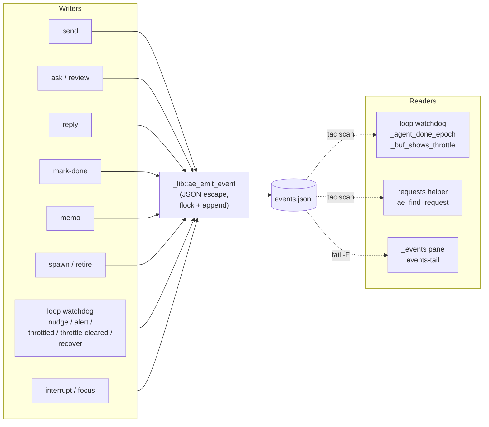

# Events

`~/.ae/sessions/<name>/events.jsonl` is ae's single durable record of what happened. Mutating helpers and ae internals write structured events; inspection helpers (`peek`, `agents`, `requests`, `events-tail`, `loop status`) read but don't write. The loop watchdog reads events to enforce its done-invalidation contract; `requests` derives pending/replied state from them. Append-only, one JSON object per line.

## Producers and consumers

Single writer (`ae_emit_event` in `_lib`), single file, multiple readers. The append-only structure plus flock-serialized writes mean readers can scan safely without coordination.



Inspection helpers (`peek`, `agents`, `requests`, `events-tail`, `loop status`) read but don't write. Mutating helpers and the loop watchdog write through the single `ae_emit_event` choke point.

## Schema

Every event has these keys; `target`, `ref`, and `summary` are optional and omitted when empty.

```json
{
  "ts":      "2026-05-19T07:29:45Z",        // ISO 8601 UTC, second precision
  "actor":   "claude:lead",                 // alias:name of the emitter (or 'loop', 'human')
  "action":  "done",                        // event type — see below
  "target":  "codex:coworker",              // alias:name of the recipient when applicable
  "ref":     "ae-20260519T072100Z-abc123",  // polysemous — see action table
  "summary": "first 200 chars of payload"   // optional preview, truncated
}
```

`ref` carries different correlation values depending on `action`:

- `ask` / `review` / `reply` — the request id pairing the three.
- `memo` — the topic the memo was filed under.
- `recover` — the captured session id (Codex/Gemini/OpenCode UUID).
- Other actions — usually absent.

String values are JSON-escaped: `\"` `\\` `\n` `\t` `\r`. The flat schema is intentionally cheap to parse from bash (`_event_json_str` in `_lib` is a pure bash walker).

## Actions

| Action | Emitted by | Meaning |
|---|---|---|
| `send` | `send` helper | One-way message between agents (or from human / loop). |
| `ask` | `ask` helper | Tracked request expecting a reply. Carries `ref`. |
| `review` | `review` helper | Like `ask`, with the critical-review prompt template. Carries `ref`. |
| `reply` | `reply` helper | Reply to an `ask` / `review`. Same `ref`. |
| `done` | `mark-done` helper | Agent self-declared complete or paused. |
| `memo` | `memo add` helper | Append to shared session memory. |
| `spawn` | ae internal | A new agent joined the workspace. |
| `retire` | ae internal | A spawned agent was removed. |
| `focus` | `focus` helper | tmux focus switch (informational). |
| `interrupt` | `interrupt` helper | Cancel signal sent. |
| `nudge` | loop watchdog | Stale-agent status check. |
| `alert` | loop watchdog / ae internal | Attention required (dead, max-nudges, persistent throttle, missing pane). |
| `throttled` | loop watchdog | First cycle of an upstream throttle streak. |
| `throttle-cleared` | loop watchdog | Throttle pattern no longer present. |
| `recover` | loop watchdog | Post-launch session id captured for a previously-pending slot. |

## How `requests` reads events

`requests [mine|inbox|all]` walks `events.jsonl` backward via `tac` and collects:

- The latest `ask` / `review` event per `ref` → request row.
- The latest `reply` event per `ref` → reply row.

A request is `replied` only when the reply's `actor` equals the request's `target` AND the reply's `target` equals the request's `actor`. Stray reply events (wrong actor / wrong target) leave the request `pending`. Without that check a misrouted or manual reply could falsely close a request.

## How `_agent_done_epoch` reads events

```bash
_agent_done_epoch <agent>
# Returns the epoch (unix seconds) of the agent's most recent done event,
# IF that done is the latest "relevant" event for the agent — meaning the
# agent is the actor or target of no newer event. Otherwise empty.
```

"Relevant" = `actor == agent` OR `target == agent` OR `target == @<this-session>:<agent>` (cross-session targeting). Scan is newest-first via `tac` and stops at the first relevant match. Unbounded by design so a `done` event stays valid however many unrelated events follow it.

## Reading events live

The hidden `ae-monitor` window has an `_events` pane running the `events-tail` helper. It prints a formatted column view with `MM-DDTHH:MM:SS` UTC timestamps:

```text
05-19T07:29:14  nudge    loop                   → claude:lead          idle 90m, no recent ae activity
05-19T07:29:45  done     claude:lead                                   All ae streamline + throttle detection...
05-19T09:05:14  nudge    loop                   → claude:lead          idle 95m, no recent ae activity
```

`peek _events [n]` for a snapshot from any pane.

## Schema stability

Adding new optional keys is fine — readers ignore unknown ones. Renaming or removing keys is breaking; ae has no schema versioning so a breaking change requires a separate migration story. As of this writing, the keys above are the stable surface.

## Disk footprint

`events.jsonl` is append-only with no rotation. Long-running sessions accumulate megabytes. Not catastrophic — the file is read backward with `tac` and matches stop early — but worth knowing for multi-day overnight setups.
