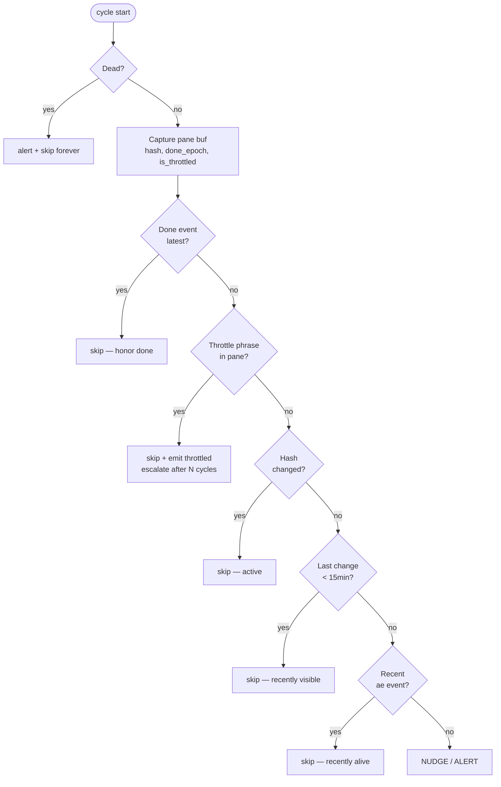
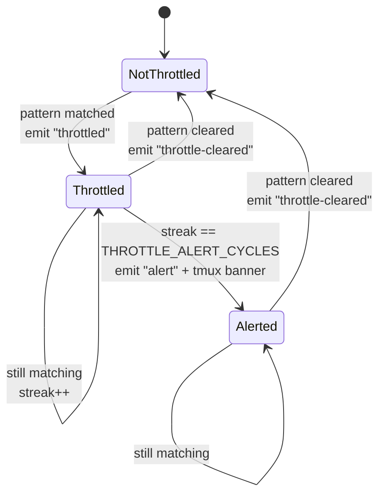

# Loop watchdog

The loop is a per-session watchdog that lives inside the hidden `ae-monitor` tmux window. It walks every registered agent pane on a fixed cycle, classifies each agent's state, and reacts: nudges idle agents, alerts on dead ones, pauses nudging when upstream rate limits are visible, and respects explicit completion signals.

## Lifecycle

- **On by default.** Created with the session, unless `workspace.loop = false` in config or the session meta says otherwise (`loop = false`). Explicit `false`/`no`/`off`/`0` disables it.
- **Manual control:** `~/.ae/sessions/<name>/loop start|stop|status`.
- **Persists across resume.** The state is recorded in session meta.
- **Self-terminates** if the tmux session or `meta` file disappears.

The watchdog runs as a `bash` subprocess pinned to a single tmux pane named `_loop`.

## Tunables

| Variable | Default | Meaning |
|---|---|---|
| `AE_LOOP_INTERVAL_SEC` | 60 | Cycle length in seconds |
| `AE_LOOP_STALE_MIN` | 15 | Idle minutes before a nudge fires |
| `AE_LOOP_MAX_NUDGES` | 2 | Nudges before escalating to alert |
| `AE_LOOP_THROTTLE_ALERT_CYCLES` | 5 | Continuous throttle cycles before throttle-alert |

Set them in the shell before `ae <name>`, or via your shell rc.

## Per-cycle state machine

For each agent pane, the watchdog walks a fixed branch order. First match wins; later branches don't fire.



In source order:

1. **Dead** — pane's foreground command is a shell AND no agent binary is in the descendant process tree. Alert once, mark dead, ignore in future cycles.
2. **Done** *(strongest)* — agent ran `mark-done` AND no newer ae event mentions them as actor or target. Skip silently.
3. **Throttled** — pane buffer contains a known upstream rate-limit / overload phrase for the agent's binary. Skip nudge, emit `throttled` event first time per streak, escalate to `alert` after `THROTTLE_ALERT_CYCLES` continuous cycles.
4. **Active** — pane content hash differs from last cycle. Update hash, reset nudge counter.
5. **Recently visible** — pane changed within the stale window. Skip.
6. **Recently alive** — agent's latest event in `events.jsonl` is younger than the stale window. Skip.
7. **Stale** — none of the above. Send "Status check" message via `send`. Up to `MAX_NUDGES` nudges. At `MAX_NUDGES` exactly, emit `alert` + tmux display banner. After that, silent waiting.

After the per-pane loop:

8. **Missing pane check** — agents registered in `meta` whose tmux panes have vanished. Alert once each.
9. **Recover pending session ids** — retry codex/gemini/opencode post-launch session capture for slots still marked `pending`.

## Done is event-only

Once an agent runs `mark-done`, the loop honors that until `_agent_done_epoch` returns empty — which happens only when a newer ae event mentions the agent. Pane hash changes, terminal resizes, scrollback churn — none of these invalidate done. The historical "pane churn after done = agent kept working" heuristic was too noisy in practice and was removed.

Concretely:

- Agent emits `mark-done` → done event in `events.jsonl`.
- Loop sees it on every subsequent cycle. Step 2 fires, skip.
- Someone sends the agent a message (`send` / `ask` / `review` / `nudge`) → newer event → `_agent_done_epoch` returns empty → done invalidated → normal state machine resumes.
- Agent emits a new event themselves → same effect.

Trade-off: silent work after `mark-done` (output without using ae helpers) is invisible to the watchdog. Acceptable because ae already requires helper discipline; if an agent resumes work, it should emit an ae event.

## Throttle detection

Tool-specific patterns inside the loop body. Narrow phrases only — false positives compound badly.

| Tool | Patterns |
|---|---|
| `claude` | `Server is temporarily limiting requests`, `API Error: Overloaded`, `Anthropic API error` |
| `codex` | `Rate limit exceeded`, `RateLimitError`, `ratelimit_exceeded` |
| `gemini` | `RESOURCE_EXHAUSTED`, `Quota exceeded` |
| `opencode` | Union of the three above (TUI wraps configurable providers) |
| generic | `429 Too Many Requests`, `503 Service Unavailable` |

When detected:

1. Skip the nudge. Reset nudge counter (so a previously stale agent's count doesn't carry over).
2. First detection of a streak → emit `throttled` event.
3. After `THROTTLE_ALERT_CYCLES` consecutive throttled cycles → emit `alert` event + tmux banner. Once.
4. When the pattern no longer matches → emit `throttle-cleared` event, reset streak.

The streak state per pane is a small machine:



There is no repeat-alert. Once an agent has been alerted for a streak, it stays in `Alerted` silently until the pattern clears. This is deliberate — paging once per streak is informative; paging every minute would be spam.

## What the watchdog cannot do

- **Restart a dead agent.** Marks it dead and stops checking.
- **Detect CLI-internal hangs that produce no pane output.** The dead-check only fires when the foreground command drops to a shell.
- **Push notifications externally.** Alerts are tmux banners + `events.jsonl` entries. Passive.
- **Distinguish slow-but-progressing from genuinely-stuck.** Both look like a static pane to the hash-based check.

For overnight runs, pair the watchdog with an external tail process on `events.jsonl` if you actually need to be paged:

```bash
tail -F ~/.ae/sessions/<name>/events.jsonl \
  | grep --line-buffered '"action":"alert"' \
  | xargs -L1 -I{} <your-pager-cmd>
```

## Inspection

```bash
~/.ae/sessions/<name>/loop status         # is the watchdog running?
~/.ae/sessions/<name>/peek _loop 60       # last 60 lines of decisions
~/.ae/sessions/<name>/peek _events 60     # event stream
```

Or via tmux directly: `Ctrl+b w`, pick `ae-monitor`.
