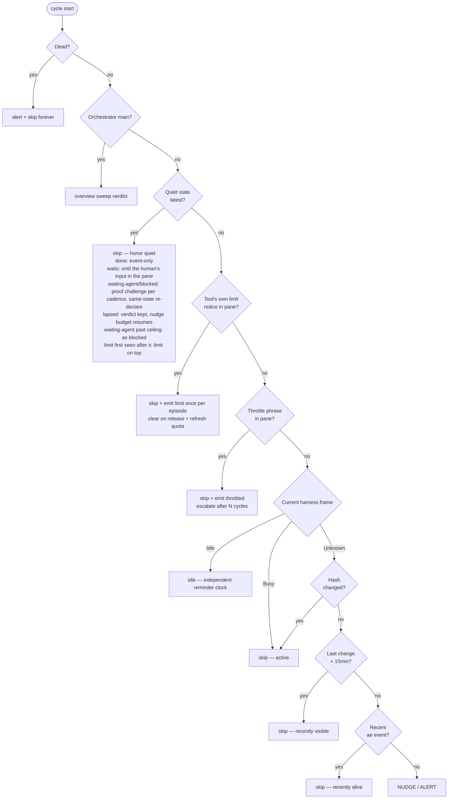
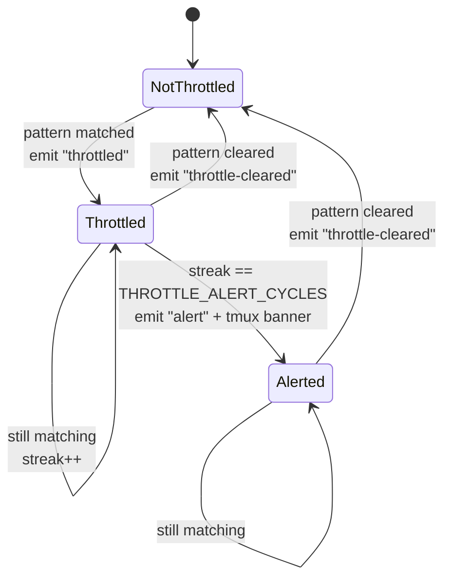

# Watchdog

The watchdog is a per-session monitor that lives inside the hidden `ae-monitor` tmux window. Its live loop is the Rust core's `_watchdog-run`, launched by the session's `watchdog` helper. It walks every registered agent pane on a fixed cycle, classifies each agent's state, and reacts: nudges idle agents, alerts on dead ones, pauses nudging when upstream rate limits are visible, and respects explicit completion signals.

The watchdog's live path is entirely in the Rust core. `_watchdog-run` owns the fixed
cycle, liveness decisions, alerts, nudges, pending session-id recovery, and Telegram
supervision.

## Lifecycle

- **On by default.** Created with the session, unless `workspace.watchdog = false` in config or the session meta says otherwise (`watchdog = false`). Explicit `false`/`no`/`off`/`0` disables it.
- **Manual control:** `~/.ae/sessions/<name>/watchdog start|stop|status` (alias: `loop`).
- **Persists across resume.** The state is recorded in session meta.
- **Repaired by publish.** An upgrade restarts a live watchdog on the new core and starts one
  that is missing from a running watchdog-enabled session. An explicitly disabled watchdog
  stays absent.
- **Self-terminates** if the tmux session or `meta` file disappears.

Each completed verdict cycle replaces one session-scoped `@ae_agents` value:
`v2;<epoch>;<interval_secs>;<name>:<profile>:<state>:<pane>:<client>:<model>:<effort>:<drift>;…`.
It contains every seat in the recorded roster's creation order, including
missing panes as `dead` with an empty pane hint, and excludes the monitor panes.
Present seats reuse that cycle's per-agent verdict and recorded profile;
`interval_secs` is this daemon's own cadence, not a reader default. The whole
value is one bounded atomic option write; an unrepresentable roster or cadence
unsets it instead of publishing a partial fact. `watchdog stop` also unsets it,
so a stopped daemon cannot leave the picker claiming a live roster snapshot.

The last four cells are what the seat's OWN frame proved this cycle, for display
only — nothing there reaches the meta, which keeps its own drift observer.
`client` is the seat's `[clients]` label fully written (recorded override,
then the profile's row, then the binary name, then the legacy short token)
and is known without a pane. `model` is the label the tool drew, `effort` its
effort word,
and `drift` a bare `!` when that model disagrees with the profile's own pin. A
model ae cannot spell EXACTLY empties that entry's trio rather than being
escaped or clipped — over 32 bytes, or carrying anything the fact's own grammar
reserves or cannot hold, including a separator, an edge space, a tmux style
byte and any non-printable. Empty cells are not a guess: the reader falls back
to the declared profile.

An identity counts only when the tool's own composer is drawn in the SAME
capture, so a frame mid-turn proves nothing. The last proven answer is then HELD
in daemon memory for at most 30 cycles, cleared by a dead verdict, a new
`launch_id` or a restart; without that hold the model cell would flap to the
declared profile and back every time a seat got busy.

A roster that will not fit the 4 KiB bound degrades in fleet-wide RUNGS, because
the model cell is a column and one dropped for some rows and not others cannot
be read down: `v2` full, `v2` with the effort and drift mark emptied, `v2` with
only the client kept, then `v1` — byte-identical to what ae wrote before these
cells existed — and only then nothing. Within `v2` the client is the cheapest
cell on the row and the last to go; the `v1` rung carries no client at all. The `v1` rung exists because `v2` costs four
more separators per entry: without it a roster that fits today could vanish
BECAUSE model cells were added, and a fact ae cannot publish is a roster the
picker reports as unavailable.

The parser accepts both words, so no compatibility shim is needed in either
direction. An older core reading a `v2` fact fails its version check, reads
nothing, and takes the `agents: unavailable` degrade it already has.

A stop retracts everything only a live daemon could vouch for — that roster, the
fleet strip, the goal, the version and the branch pair — but NOT the session's
attention. Those three options (`@ae_attn_rank`, `@ae_attn_glyph`,
`@ae_attn_style`) go back to exactly what a launch seeds, the Stale mark, because
every fleet reader drops a session that publishes no rank: unsetting them hid a
session that was still running from every other session's strip and from the
picker, while `ae list` went on calling it running. The seed is an ae fact, so it
is written only onto a session tmux still reports as ae-owned by this state root.
The session's own bar says why, in `@ae_watchdog_status`: a dim Stale mark and
`watchdog off`, from the one owner `theme::watchdog_off_segment`. A launch that
starts no watchdog (`watchdog = false`) writes that same segment, and
`watchdog start` needs no repair — the daemon publishes over it on its way up.
The same seed goes back when a daemon exits because its record stopped naming
exactly one server. It does NOT when the session is proven gone, and not on the
server a daemon is LEAVING after a rebind: neither is a session this state root
still owns, and a rank left on a stranger would put it on every ae strip.

## Adopting a watchdog-less peer's fleet strip

Every value the fleet line carries has one publisher: the session's own watchdog. So a session
whose watchdog is off — `watchdog = false`, a `watchdog stop`, or a daemon that died — kept a row
on every OTHER session's strip and had nothing at all on its own. The reader who most needs the
fleet map, somebody sitting in an unwatched session, could not see or click a single other ae
session from there.

A running watchdog therefore also writes `@ae_fleet_strip` — and ONLY that option — into every
same-server ae session with no live watchdog of its own. It is the fourth writer of the look and
has the narrowest licence of the four: a rank, a glyph, a health segment or an agents roster
written into a peer would be this daemon vouching for a session it is not measuring. The peer's
own facts keep saying `unknown`, and its bar keeps saying `watchdog off`.

- **Who is adopted.** The durable inventory, through the one `liveness::classify`, with a backend
  that answers only servers `SocketPaths` proves equivalent to this daemon's own. A candidate is
  admitted on the ownership proof `seed_unwatched` makes — an `AE_SESSION` marker plus an
  `AE_HOME` naming this state root — so a same-name stranger is never written to. It is a target
  only while its own watchdog is not live, read from its pidfile plus the verdict cycle's own
  process table. Unknown liveness is never adopted: the peer's daemon may be starting. An
  incomplete scan adopts the known and skips the unknown rather than refusing.
- **What is drawn.** The TARGET's look, never the adopter's, so a peer running the ASCII fallback
  is not handed a braille glyph; the TARGET as the current row, because a strip that cannot show
  you where you are is not a map; static, with no working frame. N adopters therefore compose
  byte-identical text and converge without electing a leader.
- **Rankless rows.** A running session ae's own records vouch for is a row even when it publishes
  no rank, drawn with the Stale mark, on every strip the daemon writes — its own included. The
  rank rule alone cannot admit one: a session nobody measures publishes no rank, and a rank is a
  tmux option a stranger could set too.
- **What it costs.** One `list-sessions` per tick carries both the ranks and every session's look,
  so there is no query per peer. Enumeration runs once per verdict cycle and reuses the table that
  cycle already took for its pane verdicts, so no tick spawns `ps`. A daemon with no targets — the
  common case — adds no tmux process and no `ps` to any tick, and with `theme = off` it still
  sleeps the whole interval. Adoption runs on its own 2 s cadence in all three ticker modes,
  attached or not: the motion ticker draws nothing while no client is attached, and the session
  being filled is exactly the one somebody IS looking at.
- **Un-adoption.** When the target's own watchdog comes back, the adopter stops writing and the
  owner publishes over it. The pause is decided by the pidfile naming a pid the enumeration did
  not see — presence alone would lock out the dead-watchdog sessions this exists for, because a
  dead daemon leaves its pidfile behind. A peer's pidfile is only ever read; the adopter never
  tidies another session's state directory.
- **Accepted limits.** A LONE watchdog-less session has no adopter, so its own line stays empty
  and the `watchdog off` mark is what says why. A stopping adopter does NOT retract the strips it
  wrote: a cross-session retraction is a race between daemons, and a strip one cycle out of date
  is a better map than none. The owner starting mid-adoption can show one static frame where an
  animated one was due: the adopter pauses within one 2 s tick of the new pidfile appearing, so
  the transient is one strip wide and the owner's own publication ends it. A recycled pid can make a dead watchdog read as live until the pidfile is
  cleaned up.

The `_watchdog` pane runs the core directly: its command is the session's `watchdog` link,
which is a symlink to the core binary under another name, dispatching to `_watchdog-run`.
There is no generated script or shell process between tmux and the core.

## Implementation: Rust core

The Rust core owns all liveness, stale, throttle, and quiet decisions, together with
their effects. A session's `watchdog` helper is one of the core symlinks generated at
launch; refreshing a session replaces the on-disk link, while a running watchdog keeps
the process it already has until it is stopped and started.

| Component | Runtime | Ownership |
|---|---|---|
| Rust core watchdog | `_watchdog-run` in the session's `_watchdog` pane | Per-cycle observation, quota-state advisories, liveness decisions, nudges, alerts, status publication, pending tool-session-id recovery, and Telegram supervision |

## Live Rust core loop

The sections below describe the Rust core's per-cycle state machine and effects.

## Tunables

| Variable | Default | Meaning |
|---|---|---|
| `AE_WATCHDOG_INTERVAL_SEC` | 60 | Cycle length in seconds |
| `AE_WATCHDOG_STALE_MIN` | 15 | Idle minutes before a nudge fires |
| `AE_WATCHDOG_MAX_NUDGES` | 2 | Nudges before escalating to alert |
| `AE_WATCHDOG_THROTTLE_ALERT_CYCLES` | 5 | Continuous throttle cycles before throttle-alert |
| `AE_WATCHDOG_TG_SUPERVISE_SEC` | 120 | Telegram-bridge revive cadence in seconds (`0` disables) |
| `AE_WATCHDOG_SWEEP_SEC` | 120 | Orchestrator changed-overview minimum-spacing fallback when persisted `sweep_sec` is absent or invalid (`0` falls back to the normal watchdog; positive values below `60` become `60`) |
| `AE_WATCHDOG_SWEEP_RETRY_SEC` | 30 | After an UNDELIVERED sweep nudge, retry this soon instead of waiting a full `AE_WATCHDOG_SWEEP_SEC` (clamped to it; floor — lands on the next poll) |
| `AE_WATCHDOG_SWEEP_RETRY_MAX` | 6 | Fast retries allowed before falling back to normal cadence and raising one `meta-agent unreachable` alert |

Set them in the shell before `ae <name>`, or via your shell rc.
For the orchestrator only, launch persists `[workspace] sweep` as `sweep_sec`;
that session fact outranks `AE_WATCHDOG_SWEEP_SEC`, which outranks 120.

Launch also persists `[workspace] quota_every_secs` (default 300, `0` disables) for every session,
and the canonical `[workspace] quota` awareness (`on` by default) beside it.
The daemon rounds that cadence up to whole verdict cycles. Each due pass — only
when the session is quota-aware — performs one bounded `ae quota` observation, keeps state by
canonical source, rollout, bucket, qualifier, and window,
then advises only the session's main and optional colead on threshold transitions. A refused paste
is retried once at the next quota observation; newer state, silence, expiry, or changed recipient
identity cancels the old booking. A helper's `UNCONFIRMED` submit counts as delivered because the
paste may have landed; only its explicit pre-submit-refusal marker permits a retry. No quota state
survives a watchdog restart but the checkpoint ask's journal receipt below.
When the session is quota-unaware (`[workspace] quota = off`), the
due pass skips the quota observation entirely: no vendor-cache read, no advisory booking, no held
observation for the throttle line below.

The same pass sends a second, differently addressed notice: the **checkpoint ask**. When a client
scope ENTERS `low` or worse — including the first sight of a scope a starting daemon already finds
there — every roster seat on that scope is asked once to write a durable checkpoint, because a seat
whose subscription runs dry can no longer be asked anything. It is advisory: it opens no request,
wants no reply and changes no state, and it rides the same guarded delivery, the same watchdog
marker and the same single retry as the advisory, under the action `quota-checkpoint`. Moving
around inside the band asks nothing further; only a band that clears and is entered again asks
again, and `classify`'s own hysteresis decides "cleared".

A window the vendor scopes to one model family — Claude's weekly Fable bucket, say — asks only the
seats not proven to run another family. A seat's live model is what its own pane drew in the
composer, held for the current launch; a recognised family (`fable`, `opus`, `sonnet`, `haiku`)
other than the window's skips the seat, and an unknown, unmodelled or expired reading asks. A seat
that switches into the family while the window is still low is asked at the next quota pass, and a
seat that joins the scope mid-episode is asked once. A seat that switches away before its booked
ask is delivered has the ask withdrawn, journaled with no target as `quota-checkpoint-cancelled`, so
no fold reads it as news about any seat. The live reading is one pass old: a switch inside one pass
is caught at the next.

The ask is once per episode across a restart too. A delivered or unconfirmed ask journals a receipt
in its ref — a hash of the window, its reset and the seat's conversation — and a restarted daemon's
first sight of a band it finds already entered skips every seat whose receipt is there. An entry
from headroom that the daemon sees always asks again. One it never saw reads as the same episode and
is not asked: the band re-entered under the same reset, which within one window only a policy change
or a vendor correction can do, while no daemon was watching. The receipt is memory, not a
guarantee: an abandoned or failed paste leaves none, so the restart asks again; a helper that dies
after its paste asks once more; a 64-bit hash collision costs one ask. Nothing here is exactly-once.

A seat is on the scope when its recorded identity — the tool kind of `agent_bin.<slot>` plus the
canonical `config_home.<slot>`, an `implicit:` home resolved through its recorded
`config_home_base.<slot>` — resolves to the source the observation was read from. That is the one
join `recorded_identity` already makes for the throttle line, so a seat matches for the ask exactly
when it would match there. Fixed and spawned seats alike qualify, and the ADVISORY's own recipients
are unchanged: that notice still goes to the session's main and optional colead only.

Four fail-closed skips: a tool with no quota parser, a config home ae cannot resolve (including a
Codex seat with no recorded conversation), a seat with no pane carrying its slot, and a pane sitting
at a shell. **Residual, named not fixed:** on the tools whose TUI ae does not model, the guarded
send cannot see a human's half-typed draft, so an ask may land mid-input there. Modelled tools
(Claude Code, Codex, Muse) defer on that draft through the existing readiness check.

Launch persists `[workspace] idle_nudge_secs` too (default 300, `0` disables).
It also persists `done_confirmations` (default 2, range 0–9); zero in either row preserves immediate done.
This clock starts when the current Claude Code or Codex frame is positively
recognized as an empty input box. A Claude Code frame qualifies only when the
input box is framed by both borders and is followed by the status line (`🧠`)
and permission-mode footer (`⏵`). Other Claude setups, including default
permission mode or a missing status line, stay Unknown and keep the legacy
motion rule. An ambiguous frame pauses the idle verdict but preserves the
episode; only Busy, a declaration, or a human draft resets it. Pane hashes,
cursor animation, and redraws cannot re-arm its budget. The clock and delivery
counters ride in the watchdog-owned `@ae_observed` pane option, guarded by the
slot+agent identity, so a watchdog restart preserves an episode while a reused
pane id does not inherit it. The option also carries the latest applied
declaration fingerprint: each new declaration resets the idle clock and
reminder budget once, including across a watchdog restart.

For an orchestrator main, each verdict cycle calls `current_world` once and
builds the same detail cards as `ae brief --all`. The pure overview renderer
omits the orchestrator's own session and bounds data lines to 100 characters.
`NEEDS YOU` has one heading per session and includes only explicit
`waiting-user`/`blocked` declarations from that session's main or named
`colead` (a `waiting-agent` past its ceiling is materialized as `blocked`);
worker declarations stay with their session leadership. Sessions and
their needs sort oldest first. Each need occupies at most twelve lines: after
the first identity-bearing line, continuation lines have a four-space indent
and a 96-character body. Word wrapping consumes at least half of each
non-final line, so even the worst split carries a full 600-character reason;
only text beyond that bound is ellipsized.
Unanswered asks/reviews never enter `NEEDS YOU`; their count is appended once to
the session's first `WORKING` row when nonzero. The renderer groups the remaining
facts under `WORKING` and `QUIET`. The watchdog hashes the semantic facts behind
that text and pastes it only when the last delivered hash differs and the minimum
spacing has elapsed. Elapsed age labels and request bodies never change the hash;
leadership state/reason or the per-session open-request count does. Unchanged
cycles never wake the model.

A main-seat `state working` declaration holds a changed overview for 600
seconds. During that hold there is no delivery attempt or booking: the
delivered hash and both spacing clocks remain unchanged, so the next cycle
retries the same overview. At 600 seconds the hold expires and delivery may
proceed, preventing a stuck `working` declaration from starving the human.
Other declarations and an idle seat never hold an overview.

`meta-agent-state.json` carries the watchdog heartbeat, semantic hash, the
oldest delivery awaiting acknowledgement, and the latest successful delivery
used for spacing. Both delivery clocks are captured after the checked submit;
repeated unacknowledged deliveries advance spacing but never slide the oldest
acknowledgement deadline. A restart therefore neither resends unchanged text,
forgets spacing, nor grants a fresh grace window. The file mtime is not seat
liveness: the main seat's newest `state done` event in `events.jsonl` must be at
or after the latest successful delivery before it acknowledges the batch. The
oldest outstanding delivery still owns the fixed deadline; no qualifying
`done` past `sweep * 2 + 60` seconds becomes `wedged`, and the next qualifying
`done` clears it. For an idle seat, the only action on the pasted turn is that
acknowledgement. If a human instruction is already in progress, the seat
finishes it before acknowledging; an overview is a notification, never a
replacement task. The seat never runs `ae brief --all` on a timer.

## Per-cycle state machine

Before walking panes, a due quota pass refreshes the session-local advisory state — unless the
session is quota-unaware, in which case there is no advisory state to refresh. The first sample
is silent. `headroom` is below 80%, `low` begins at 80%, and `critical` at 95%; downward hysteresis
leaves those states below 75% and 90% respectively. Unsupported, unreadable, truncated, unknown,
or older-than-60-minute rows are silent and drop prior state.

Per client scope the daemon holds ONE classified reading: the level, the accepted observation, the
policy it was judged under, and the provenance of all of it. A newer observation replaces the row, a
changed declaration or a newer account fact re-judges the row already held, and an older observation
is refused whatever arrives with it; the level is decided again from whatever is then held, anchored
on the level held until then, which is where the hysteresis above lives. Everything a seat is then
told — the notice, its booked provenance, and the quota line appended to a throttle nudge — is
rendered from that one value, so a refused observation's percentage or age never appears beside a
level it did not decide. The daemon cannot do otherwise: a level exists only inside a classified
reading, and no renderer accepts one separately.

For each agent pane, the watchdog walks a fixed branch order. First match wins; later branches don't fire.



The classifier reads only the same current 40-row `capture-pane` result the
watchdog already takes. It never opens a harness transcript or conversation
store. Claude Code and Codex have positive frame grammars; unsupported,
partial, modal, or ambiguous frames are `Unknown` and retain the legacy
hash/event heuristic.

In source order:

1. **Dead** — pane's foreground command is a shell AND no agent binary is in the descendant process tree. Alert once, mark dead, ignore in future cycles — until a POSITIVE process reading shows the agent binary back under the pane (a re-run in place), which clears the latch with one `dead-cleared` and judges that same cycle normally. An UNKNOWN snapshot is not evidence of life and keeps the latch; a seat that dies again is alerted again.
2. **Orchestrator main** — use overview-sweep accounting; no harness-idle reminder competes with it.
3. **Declared quiet state** — agent's latest relevant event is its own `state` declaration of `done`, `waiting-user`, `waiting-agent`, or `blocked` (`mark-done`/`done` events count as `done`), AND nothing newer ends it (see *Quiet states* below). A human-only prompt on a declared seat keeps the declaration on the bar but is still booked under it: named once per episode, with its `human-prompt` record and one Notify. `done` is event-only: the shared journal fold challenges it once per cadence until N later declarations confirm it; an unanswered challenge lapses into today's bounded idle path, while late proof keeps its credit. `waiting-user` is never challenged; all three waits end on the human's input in the pane (see *Quiet states* below), and `waiting-agent`/`blocked` are challenged like `done` (strict same-state proofs, re-armed forever, never terminally confirmed): lapsed waits keep their verdict while the nudge budget resumes beside them. `waiting-agent` is the quiet fifth state: it means the seat waits on ANOTHER ae agent, claims no human while fresh, and — once its declaration has aged past `idle_nudge_secs * OWN_WORK_AGE_CAP` nudge periods (the same multiplier as the own-work deferral, with ONE deliberate exception: at `idle_nudge_secs = 0` the deferral is vacuous — there is no nudge to defer — while the attention ceiling scales from the documented default 300 s, so 1200 s, because zero keeps the marker and only suppresses the nudge) — it stops holding and is judged exactly as `blocked`: the verdict published is `blocked` (the attention half), and the nudge budget resumes (the nudge half, off when `idle_nudge_secs = 0` like every nudge) unless an active wait episode owns the seat's next delivery — then the challenge is the one order, and only a lapsed or untracked episode resumes the budget. The ceiling is measured from the declaration's own timestamp and has ONE owner (`watchdog::waiting_agent_escalated`), shared by the daemon and the read surfaces, so they cannot disagree about escalation: `session::declared_reason` asks it AND the daemon's currency rule, and every human surface consumes that answer through `AgentEntry.reason` rather than recomputing any arithmetic. Currency itself is judged by the ONE routing-aware relevance owner (`watchdog::latest_relevant_event`, over `event_is_actor`/`event_is_addressed_to`), called by BOTH the daemon and `session::agent_entries` with the same routing key the declaration is matched by, so a rename-back history cannot make one selection routing-aware and the other display-only. ONE daemon-only reading is named rather than faked: the daemon also ends a wait on client input in the pane, which a directory read cannot see, so a wait the daemon has ended that way can still read as current on the human-marker surfaces (the pane border follows the daemon). A usage limit (branch 4) FIRST SEEN no earlier than the declaration outranks it and ends nothing: it is booked and named as in branch 4, the bar and `ae list` read `limit` (`session::agent_entries` lets a standing `limit` alert, which the journal fold keeps only while it is newer than the seat's own record, replace the declared half of the reason instead of losing the rank-3 tie to `blocked`), and its release hands the bar straight back. One already showing when the seat declared stays under the declaration. The latch carries its first sight's epoch — the instant of its one `limit` record — and the daemon compares it with the declaration's age, a tie going to the human.
4. **Usage limit** — the tool's OWN notice row, inside the capture's bottom window, starts with a phrase from the vendor's usage-limit catalog for the agent's binary (measured per tool; see below). A transcript row quoting a banner never books one (#189). Outranks the transient branch: skip the nudge like throttling, emit ONE durable `limit` event per episode, and publish the verdict word `limit` (the existing NeedsYou mark, attention rank 3 — exactly `blocked`'s). When a later cycle judges the pane and the phrase is gone, the latch releases with one `alert-cleared` and the quota recovery pass runs once (see below). Dead wins: a pane whose process is gone is never judged here.
5. **Throttled** — the current capture contains a known upstream rate-limit / overload phrase for the agent's binary. Skip nudge, emit `throttled` event first time per streak, escalate to `alert` after `THROTTLE_ALERT_CYCLES` continuous cycles.
6. **Busy frame** — positively recognized execution. Mark working, reset idle and reminder state, and clear a durable stale alert.
7. **Idle frame** — positively recognized empty input. Mark idle immediately; after `idle_nudge_secs`, send `you look idle: declare state or continue` through the existing `send` path. At the normal maximum, emit the same durable stale alert and keep it across daemon restarts until real Busy recovery.
   - **Outstanding own work DEFERS that reminder.** A seat with a request it SENT that the ledger has not closed, or an agent it SPAWNED that still holds a seat here, is not idle — it is the thing everybody else is waiting on. The empty input box is the right reading of the pixels and the wrong reading of the facts. Both are facts ae already owns: [`session::Outstanding`](../../src/session.rs) reads them from the pending-request sensor and the spawn/retire ledger, and nothing new is persisted, captured or published for them. Requests RECEIVED never count — answering one is the seat's own job.
   - THREE records close a request and stop it deferring, and nothing else does. A `reply` closes one by its REQUEST ID — for an external slotless asker (`tracked::is_external`: the chat bridges and ae's own `ae:` verbs), by the target display, because that asker has no routing key to match. A `cancel` closes one by its REQUEST ID, but no agent helper emits one: the only production emitter is `ae reboot --digest-only`, which refuses any handover reboot did not open. A `retire` closes one by SEAT at EITHER end — the slot the request was sent to or the slot that sent it, compared by routing key and never by display name — and it counts only when it is recorded in the SAME session and that session has not been renamed since the request was recorded. Retiring a worker clears the questions it asked from its target's inbox: nobody is left to read a reply. The retire rides the same forward pass a reply rides, and that pass only ever removes, so a name or a `spawned.<n>` slot handed to a replacement raises nothing.
   - EVERY other request keeps deferring, however unanswerable it has become. A CROSS-SESSION request keeps deferring in the CALLER's log: the record is written into both participants' logs carrying the TARGET's session, so the sessions agree only in the target's log, which is also the only log the seat's own retire is written to — and the asker arm judges by that same target-home session, so the caller's copy stays open whichever end the retire names. A request recorded BEFORE its session was renamed keeps deferring: [`rename`](../../src/rename.rs) moves the session directory and rewrites the meta, so the reader supplies the new name while the record still carries the old one. A party that vanished with NO retire record keeps deferring, because there is nothing to match. So does whatever [`requests`](../../src/requests.rs) decides on its own, which is a separate state machine. None of these is closed anywhere: closing the first means one session judging another's ledger, and closing the second needs a session identity that survives renaming, which the routing key deliberately does not have.
   - The deferral is bounded on two clocks, whichever ends first: the idle episode reaching `(max_nudges + 1) x idle_nudge_secs`, which is the whole nudge budget's worth of deferred opportunities, or the oldest outstanding item passing `4 x idle_nudge_secs`. Past either, the seat spends its ORDINARY budget — the same nudges and the same durable alert — and each reminder names what ae thinks it is waiting on. Suppression is a DEFERRAL, never silence: a genuinely wedged lead is still caught, it is just caught later.
   - A seat is matched on its ROUTING KEY wherever the writer recorded one (`session::is_actor`, the same rule a declaration is matched by), and only on the display name for a legacy record that carries no key. A rename churns the name; it must not hand a seat somebody else's open work, nor lose its own.
   - A spawn defers only while its seat is actually HELD, decided on the cycle's own evidence: the Dead verdict does not hold, and the pane is not sitting at a bare shell — the two conjuncts `ae list` renders, so the publisher's decision and the human's explanation cannot disagree. A spawned tool that exited into its retained shell excuses nobody. UNKNOWN policy is two cases, not one rule, because the pane's foreground command is read first: a pane at a bare shell holds no seat whatever the snapshot says, so an uncertain snapshot never rescues it; a pane running a real tool keeps its seat when the snapshot cannot confirm the process, because the Dead verdict demands positive absence and a probe gap is not proof of death. That second deferral is retained rather than unbounded — the same two clocks end it.
   - `ae list` prints the same reason on the agent's line (`· waiting on 2 requests, 1 spawn`), so the human reads why a seat is quiet without opening its pane.
8. **Unknown frame** — run the legacy hash/event heuristic: changed or recently changed is active; a recent ae event is active; otherwise send the legacy status check, then alert at the same maximum.

After the per-pane pass:

9. **Missing pane check** — agents registered in `meta` whose tmux panes have vanished. Alert once each.
10. **Recover pending session ids** — retry codex/gemini/opencode post-launch session capture for slots still marked `pending`.

The list/brief attention reader treats the session's latest successful launch as
a recovery boundary: a durable watchdog alert older than `started=` no longer
contributes `attn:dead`, `attn:stale`, `attn:limit`, or `attn:throttled`. An alert at or
after that boundary still contributes normally, so a seat that dies after
relaunch is visible. Legacy metadata uses the newest `launch_time.main` or
`launch_time.worker.*` as the boundary; only sessions lacking both clock forms
keep the prior behavior.

## Quiet states and how they're invalidated

`watchdog::quiet_reason` returns an agent's current quiet state (`done` / `waiting-user` / `waiting-agent` / `blocked`), or none. It reads the *latest relevant event* for the agent: a `state` declaration (or a `mark-done`/`done` event, mapped to `done`) stays current until a newer record ends it or a challenge footprint disqualifies it. ONE table, `watchdog::ends_quiet`, says which records are news against it. The seat's own re-declaration and the human's chat-bridge message (`telegram:`/`discord:` actors) end every quiet state. A reply to one of the seat's OWN asks or reviews (matched by `ref`) also ends `waiting-agent`. Any other record that is not the watchdog's — the seat's own sends, memos and replies, a peer's send, ask or review — ends `done` alone: a wait outlives its own chasing and its peers' traffic. No watchdog record is news: alerts, `human-prompt`, the quota advisory and checkpoint (and their drops), and the orchestrator's overview prompt, booked as its own `sweep-nudge` action so a changed overview no longer lapses a provisional `done` (#145). Its challenge footprints still decide currency inside an episode (`watchdog::declaration_current`): a matching challenge or abandonment preserves its own episode, the idle `nudge` is the lapse mark of `done`, a crossed challenge disqualifies any declaration, and for `waiting-user` every challenge and abandoned challenge does. The folds read a challenge summary through ONE grammar, `watchdog::challenge_named`, fuzzed as `challenge_summary`. A challenge the send helper refuses BEFORE its paste is journaled as an `[unconfirmed]` attempt of that same challenge with `; refused pre-paste: <why>` appended, so both folds count it toward `undelivered_max` and the one unreachable alert fires (#148). Named residuals: an `AE_SENDER_OVERRIDE` can journal a bridge actor; a pane-less sender journals `human`, which is not human evidence; a `relay` is journaled only in its caller's ledger; sweep records an older core wrote as `nudge` still lapse a `done` for one cycle.

**`done` is event-only.** Pane hash changes, terminal resizes, scrollback churn — none of these revive a done agent. That hash is taken over the pane view with the watchdog's OWN deliveries removed — `watchdog::quiet_filter` strips every shape the nudge generators emit, from the raw one-line form to the rendered block, so a delivered nudge is never read as pane motion. The historical "pane churn after done = agent kept working" heuristic was too noisy and was removed. Trade-off: silent work after `done` (output without ae helpers) is invisible to the watchdog. Acceptable — ae already requires helper discipline; a resuming agent should emit an ae event.

**`waiting-user` / `waiting-agent` / `blocked` end on the human's input in the pane.** These states mean the agent is parked, but the unblocking input often arrives as the human typing *directly in the pane* — which produces no `events.jsonl` entry. The daemon reads the tmux clients once per cycle (`transport::observe_clients`, the send gate's own read) and keeps, per pane, the newest input of any client viewing it, keyed by the seat's identity so a reused pane id never inherits another seat's memory, and held across a detach; a failed read changes nothing. A wait ends when that input is STRICTLY newer than both the declaration and the watchdog's newest delivery to the seat that may have painted the pane — an idle or sweep nudge, a challenge, a quota advisory or checkpoint ask, unconfirmed ones included, never one refused before its paste (`watchdog::last_watchdog_delivery`, judged by `watchdog::human_input_ends_wait`). The delivery bound is what caps a stray input at one extra nudge: the nudge it lets through re-arms the hold. That nudge names the ended wait — the state, the age of the input and the fact that a client viewing the pane gave input, never that the human answered — in its text and in its journal summary (`watchdog_daemon::nudge_words`), so a seat whose wait still holds can re-declare it instead of reading the nudge as an unexplained lapse. Pane output, repaint and resize end no wait, and `done` never ends on input. Named residuals: stray client input — a click, a scroll, a status-line click or a window switch onto the pane — ends a wait early; a `waiting-user` outlives a seat that resumes work without re-declaring; the memory is lost on a daemon restart; input followed by a detach between two polls is never seen; `ae list` cannot see client activity. `waiting-agent` is the one quiet state with a CEILING: past `idle_nudge_secs * OWN_WORK_AGE_CAP` nudge periods the seat reads as `blocked` — attention marker always; the human's input still ends the hold, and the nudge budget resumes only when `idle_nudge_secs > 0` and no active wait episode owns the next delivery (then the challenge is the one order). At `idle_nudge_secs = 0` the ceiling falls back to the documented default cadence (1200 s) instead of the vacuous `0 * 4`: the deferral is about not nudging, and the marker must survive the knob that suppresses the nudge, or a quiet state that never claims the human becomes a silent stall.

Concretely:

- Agent emits `state blocked "Codex review blocks merge; lead unblocks req-Z. I ran local tests and recorded failures in .local/review.md."` → state event in `events.jsonl`.
- The watchdog skips it each cycle while nothing ends it (step 3 fires).
- Human types unblock info in the pane → a client viewing the pane reports input newer than the declaration and the watchdog's last delivery → the wait ends → normal state machine resumes; if the agent then hangs, it gets nudged.
- Another agent's message, or the agent's own sends and memos, leave it standing; the human's chat-bridge message, the agent's re-declaration and — for `waiting-agent` — a reply to one of its own asks end it.

### `done` dual-emit

`state done` (and its `mark-done` alias) emit both a `state ref=done` event and an `action=done` event; the watchdog reads either, so a watchdog process started before the `state` helper still recognizes completions.

## Throttle detection

Tool-specific patterns inside the watchdog body, split into the two classes: **transient** throttling (upstream recovers on its own) and the vendor's **usage limit** (persists until a window reset or a re-login). One classifier reads both, and a usage-limit phrase wins when both appear. Narrow phrases only — false positives compound badly.

Transient phrases:

| Tool | Patterns |
|---|---|
| `claude` | `Server is temporarily limiting requests`, `API Error: Overloaded`, `Anthropic API error` |
| `codex` | `Rate limit exceeded`, `RateLimitError`, `ratelimit_exceeded` |
| `gemini` | `RESOURCE_EXHAUSTED`, `Quota exceeded` |
| `opencode` | Union of the three above (TUI wraps configurable providers) |
| generic | `429 Too Many Requests`, `503 Service Unavailable` |

Usage-limit phrases, MEASURED from each tool's own strings (claude 2.1.281, codex 0.156.1;
a tool with no measurement ships an empty list, never a guess). They count ONLY on the tool's own
notice row: inside the bottom window (claude 20 rows, codex 16, up from the last non-blank row),
starting at column 0 with the tool's marker, and — past spaces and NBSP — starting with a phrase.
The transient phrases above still match anywhere in the capture (a named residual).

| Tool | Notice row | Patterns |
|---|---|---|
| `claude` | `  ⎿` | `You've hit your`, `You've reached your`, `You're out of usage credits`, `Your org is out of usage`, `usage limit reached` |
| `codex` | `■` | `You’ve hit your usage limit` (U+2019, as 0.156.1 draws it), `You've hit your usage limit`, `You've reached your usage limit`, `Usage limit reached. You've reached your usage limit`, `Quota exceeded. Check your plan` |
| `gemini`, `opencode`, others | *(none measured)* | *(none)* |

When a transient phrase is detected:

1. Skip the nudge. Reset nudge counter (so a previously stale agent's count doesn't carry over).
2. First detection of a streak → emit `throttled` event.
3. After `THROTTLE_ALERT_CYCLES` consecutive throttled cycles → emit `alert` event + tmux banner. Once.
4. When the pattern no longer matches → emit `throttle-cleared` event, reset streak.

When a usage-limit phrase is detected:

1. Skip the nudge, the same way. Enter the per-pane limit latch.
2. First detection of an episode → emit exactly one `limit` event and one Notify naming the seat,
   both quoting the vendor's cell (it carries the reset time). The event reads as `attn:limit`
   (rank 3, exactly `blocked`'s) on `ae list` and in the digest, and draws the
   existing NeedsYou mark with the word `limit` on the pane border.
3. Every later matching cycle keeps the verdict, silently — one event per episode.
   A FAILED pane read is not a release: the latch holds and the verdict stays `limit` until a
   capture SUCCEEDS and lacks the notice (the same absence-of-evidence rule the dead latch follows).
4. When a cycle judges the pane and the phrase is gone (a dead pane never reaches this branch —
   it returns at step 1 of the branch order), the latch releases with one `alert-cleared`, and the
   sweep runs ONE immediate quota pass for the seat's client scope — the same refresh the cadence's
   due path calls, invoked directly and at most once per release, never through the due counter, so
   the cadence keeps its own schedule. A re-login that restores headroom is therefore visible on the
   next `ae list` instead of after `quota_every_secs`. The pass runs even when the cadence is
   disabled (`quota_every_secs = 0`); `quota = off` runs none.

A return to plain throttling after a limit episode emits a fresh `throttled` event: the limit
episode ends the transient streak.

On the first throttle event only, the watchdog may append the worst row from its last scheduled
quota observation — never when quota-unaware, where there is no scheduled observation to read
from. The source must exactly match the seat's recorded config-home mode/base; Codex
also requires the recorded rollout id. Missing or legacy identity, another rollout, and expired or
silent rows leave the existing throttle event unchanged. This lookup uses the uncapped observation
and never reads a vendor cache from the throttle path.

The streak state per pane is a small machine:



There is no repeat-alert. Once an agent has been alerted for a streak, it stays in `Alerted` silently until the pattern clears. This is deliberate — paging once per streak is informative; paging every minute would be spam.

## Human-only prompts

A modal only the human may answer is NAMED and never answered: no key reaches it, and ae writes
no tool's trust list or config. `watchdog::human_prompt_class` is the one detector, pure over a
frame and the seat's binary name; the shape comes from that tool's adapter row
(`tool::PromptSpec`), so a tool with no row, or a renamed binary, reads as no prompt.

| Tool | Question row | Anchor | Selected | Key hint | Window |
|---|---|---|---|---|---|
| `agy` | ends in `?` | none | `>` | `enter Confirm` or `↑/↓ Navigate` | 15 rows |
| `claude` | starts `Quick safety check:` | `Accessing workspace:` under a `─` rule no row below is wider than | `❯` | `to confirm · ` | 20 rows |

The claude row is claude 2.1.281's folder-trust modal, measured at 80×24 and 200×50, bare and
under `--permission-mode bypassPermissions` (the modal rows below the launch line are
byte-identical); provenance in `tests/fixtures/claude-trust/`. A window where the tool's own
composer is drawn (`deliver::region::composer_drawn`) is never a prompt, and readiness reads the
modal as occupied.

A turn ae PASTES reads it while it waits (`session_launch::deliver_launch_turn`). `reseat` and
`relaunch` fail FAST: the same question on two consecutive reads ends the turn `Blocked`, exit 1,
naming the prompt and the pane; a reseat then prints the hand-send of its kept seed, a relaunch
says to re-send its turn. A session launch keeps its full 45 s wait, because a human there can
answer and the turn still lands; it names the prompt only if it is still up at the end. Readiness
wins whenever the prompt clears. Only a pasted turn reads it: claude takes its context on the argv,
so a fresh launch, a relaunch and a reseat that carries its conversation paste nothing to a claude
seat and exit without looking; the watchdog names the modal there, and a spawn brief waits in the
brief retry, which refuses while the prompt is up.

Named residuals: claude's accessible `Enter y/n:` branch, a project-settings warning block and
panes narrower than about 65 columns are unmeasured and can push the modal out of the window, so
they degrade to the generic "never landed" text; a fresh home's bypass-acceptance screen is
unmeasured; the trust key's meaning is unmeasured by rule (Yes is never pressed), so a reseat does
not refuse on a guess before it stops a tool — measured only: "No, exit" writes no project entry;
a human who answers after the fail-fast sends the seed by hand; a turnless relaunch and a carried
reseat exit by their ordinary rules while the seat may sit on the modal, left to the watchdog.

## What the watchdog cannot do

- **Restart a dead agent.** Marks it dead and stops checking.
- **Detect CLI-internal hangs that produce no pane output.** The dead-check only fires when the foreground command drops to a shell.
- **Push notifications externally.** Alerts are tmux banners + `events.jsonl` entries. Passive.
- **Prove progress inside a long-lived Busy frame.** A stuck spinner still looks Busy; unsupported
  or ambiguous harness frames keep the conservative legacy hash/event fallback.

For overnight runs, pair the watchdog with an external tail process on `events.jsonl` if you actually need to be paged:

```sh
tail -F ~/.ae/sessions/<name>/events.jsonl \
  | grep --line-buffered '"action":"alert"' \
  | xargs -L1 -I{} <your-pager-cmd>
```

## Inspection

```sh
~/.ae/sessions/<name>/watchdog status         # is the watchdog running?
~/.ae/sessions/<name>/peek _watchdog 60       # last 60 lines of decisions
~/.ae/sessions/<name>/peek _events 60     # event stream
```

Or via tmux directly: `Ctrl+b w`, pick `ae-monitor`.
