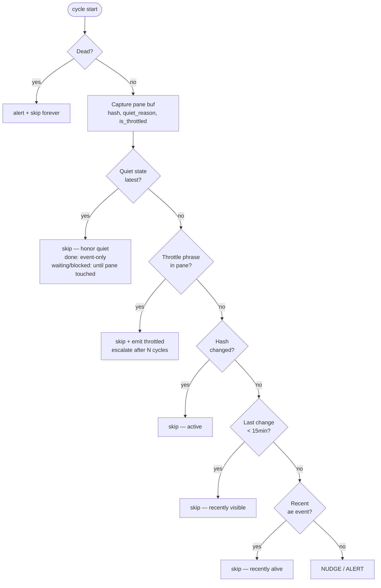
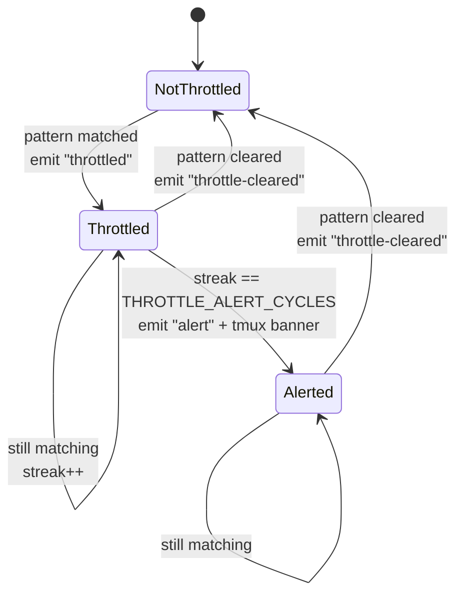

# Watchdog

The watchdog is a per-session monitor that lives inside the hidden `ae-monitor` tmux window. It walks every registered agent pane on a fixed cycle, classifies each agent's state, and reacts: nudges idle agents, alerts on dead ones, pauses nudging when upstream rate limits are visible, and respects explicit completion signals.

## Lifecycle

- **On by default.** Created with the session, unless `workspace.watchdog = false` in config or the session meta says otherwise (`watchdog = false`). Explicit `false`/`no`/`off`/`0` disables it.
- **Manual control:** `~/.ae/sessions/<name>/watchdog start|stop|status`.
- **Persists across resume.** The state is recorded in session meta.
- **Self-terminates** if the tmux session or `meta` file disappears.

The watchdog runs as a `bash` subprocess pinned to a single tmux pane named `_watchdog`.

## Tunables

| Variable | Default | Meaning |
|---|---|---|
| `AE_WATCHDOG_INTERVAL_SEC` | 60 | Cycle length in seconds |
| `AE_WATCHDOG_STALE_MIN` | 15 | Idle minutes before a nudge fires |
| `AE_WATCHDOG_MAX_NUDGES` | 2 | Nudges before escalating to alert |
| `AE_WATCHDOG_THROTTLE_ALERT_CYCLES` | 5 | Continuous throttle cycles before throttle-alert |
| `AE_WATCHDOG_TG_SUPERVISE_SEC` | 120 | Telegram-bridge revive cadence in seconds (`0` disables) |
| `AE_WATCHDOG_SWEEP_SEC` | 300 | Steward/meta-agent sweep cadence in seconds (`0` falls back to the normal watchdog) |

Set them in the shell before `ae <name>`, or via your shell rc.

## Compatibility (renamed from `loop`)

This feature was called **`loop`** before. The old names still work as deprecated
aliases so existing config, shell rc, scripts, and running sessions don't break:

| Surface | Canonical | Deprecated alias (still honoured) |
|---|---|---|
| Command | `ae watchdog start\|stop\|status` | `ae loop …` |
| Helper path | `~/.ae/sessions/<name>/watchdog` | `loop` wrapper |
| Env tunables | `AE_WATCHDOG_*` | `AE_LOOP_*` |
| Config key | `workspace.watchdog` | `workspace.loop` |
| Meta key | `watchdog=` | `loop=` (read on resume, then converged) |

Precedence is canonical-wins: if both `watchdog` and `loop` forms are present, the
`watchdog` form is used. A session created before the rename is migrated on its next
start/resume. A pre-rename watchdog still running under the old `_loop` pane and pid
file is reaped automatically when the watchdog next starts or stops, so two watchdogs
never run at once. The aliases will be removed once no pre-rename sessions remain in
the wild.

## Per-cycle state machine

For each agent pane, the watchdog walks a fixed branch order. First match wins; later branches don't fire.



In source order:

1. **Dead** — pane's foreground command is a shell AND no agent binary is in the descendant process tree. Alert once, mark dead, ignore in future cycles.
2. **Declared quiet state** *(strongest)* — agent's latest relevant event is its own `state` declaration of `done`, `waiting-user`, or `blocked` (legacy `mark-done`/`done` events count as `done`), AND no newer ae event mentions them as actor or target. `done` is skipped silently and is event-only (pane churn never revives it). `waiting-user`/`blocked` are also skipped, but yield to pane activity: if the pane changed since the declaration (e.g. the human replied directly in it, leaving no event), the quiet state no longer holds and the normal branches resume — so a post-reply hang is still caught.
3. **Throttled** — pane buffer contains a known upstream rate-limit / overload phrase for the agent's binary. Skip nudge, emit `throttled` event first time per streak, escalate to `alert` after `THROTTLE_ALERT_CYCLES` continuous cycles.
4. **Active** — pane content hash differs from last cycle. Update hash, reset nudge counter.
5. **Recently visible** — pane changed within the stale window. Skip.
6. **Recently alive** — agent's latest event in `events.jsonl` is younger than the stale window. Skip.
7. **Stale** — none of the above. Send "Status check" message via `send`. Up to `MAX_NUDGES` nudges. At `MAX_NUDGES` exactly, emit `alert` + tmux display banner. After that, silent waiting.

After the per-pane pass:

8. **Missing pane check** — agents registered in `meta` whose tmux panes have vanished. Alert once each.
9. **Recover pending session ids** — retry codex/gemini/opencode post-launch session capture for slots still marked `pending`.

## Quiet states and how they're invalidated

`_agent_quiet_reason` returns an agent's current quiet state (`done` / `waiting-user` / `blocked`) plus its declaration timestamp, or empty. It reads the *latest relevant event* for the agent: a `state` declaration (or a legacy `mark-done`/`done` event, mapped to `done`) wins only if no newer event mentions the agent as actor or target. An inbound `send`/`ask`/`review`/`nudge` is newer → quiet state invalidated.

**`done` is event-only.** Pane hash changes, terminal resizes, scrollback churn — none of these revive a done agent. The historical "pane churn after done = agent kept working" heuristic was too noisy and was removed. Trade-off: silent work after `done` (output without ae helpers) is invisible to the watchdog. Acceptable — ae already requires helper discipline; a resuming agent should emit an ae event.

**`waiting-user` / `blocked` yield to pane activity.** These states mean the agent is parked, but the unblocking input often arrives as the human typing *directly in the pane* — which produces no `events.jsonl` entry, only a pane-hash change. The watchdog keeps a per-pane **quiet baseline** (`_quiet_pane_decision`): the first cycle that observes a declaration *arms* the baseline with the current pane hash — already including the declaration's own echo, since the `state` helper prints to the pane — and honors the quiet state. Subsequent cycles *hold* (suppress nudges) while the hash equals that baseline, and *yield* once it changes (human reply / agent output), at which point the normal active/recent/stale branches resume. Baselining on the echoed hash is essential: a naive "no pane change since the declaration timestamp" check would be tripped by the echo itself and never suppress a single nudge.

Concretely:

- Agent emits `state blocked "waiting on X"` → state event in `events.jsonl`.
- The watchdog skips it each cycle while the pane is quiet (step 2 fires).
- Human types unblock info in the pane → pane hash diverges from the armed baseline → `_quiet_pane_decision` yields → normal state machine resumes; if the agent then hangs, it gets nudged.
- Or another agent sends it a message → newer event → quiet invalidated the same way.

### Legacy `done` dual-emit (transitional)

`state done` (and the `mark-done` shim) emit *both* a `state ref=done` event and a legacy `action=done` event. The watchdog reads either. The dual-emit exists so a still-running pre-state-helper watchdog process (which only understands `action=done`) keeps recognizing completions after helpers are refreshed. It will be removed once `ae doctor --refresh` restarts a running watchdog.

## Throttle detection

Tool-specific patterns inside the watchdog body. Narrow phrases only — false positives compound badly.

| Tool | Patterns |
|---|---|
| `claude` | `Server is temporarily limiting requests`, `API Error: Overloaded`, `Anthropic API error` |
| `codex` | `Rate limit exceeded`, `RateLimitError`, `ratelimit_exceeded` |
| `gemini` | `RESOURCE_EXHAUSTED`, `Quota exceeded` |
| `opencode` | Union of the three above (TUI wraps configurable providers) |
| generic | `429 Too Many Requests`, `503 Service Unavailable` |

When detected:

1. Skip the nudge. Reset nudge counter (so a previously stale agent's count doesn't carry over).
2. First detection of a streak → emit `throttled` event.
3. After `THROTTLE_ALERT_CYCLES` consecutive throttled cycles → emit `alert` event + tmux banner. Once.
4. When the pattern no longer matches → emit `throttle-cleared` event, reset streak.

The streak state per pane is a small machine:



There is no repeat-alert. Once an agent has been alerted for a streak, it stays in `Alerted` silently until the pattern clears. This is deliberate — paging once per streak is informative; paging every minute would be spam.

## What the watchdog cannot do

- **Restart a dead agent.** Marks it dead and stops checking.
- **Detect CLI-internal hangs that produce no pane output.** The dead-check only fires when the foreground command drops to a shell.
- **Push notifications externally.** Alerts are tmux banners + `events.jsonl` entries. Passive.
- **Distinguish slow-but-progressing from genuinely-stuck.** Both look like a static pane to the hash-based check.

For overnight runs, pair the watchdog with an external tail process on `events.jsonl` if you actually need to be paged:

```bash
tail -F ~/.ae/sessions/<name>/events.jsonl \
  | grep --line-buffered '"action":"alert"' \
  | xargs -L1 -I{} <your-pager-cmd>
```

## Inspection

```bash
~/.ae/sessions/<name>/watchdog status         # is the watchdog running?
~/.ae/sessions/<name>/peek _watchdog 60       # last 60 lines of decisions
~/.ae/sessions/<name>/peek _events 60     # event stream
```

Or via tmux directly: `Ctrl+b w`, pick `ae-monitor`.
