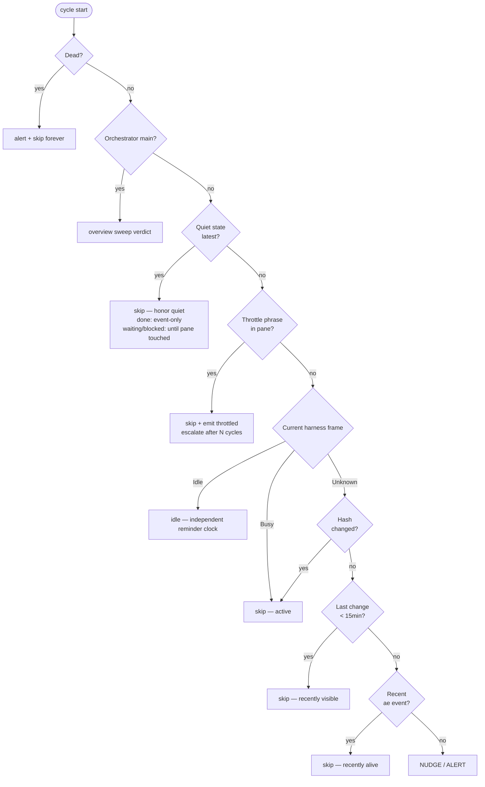
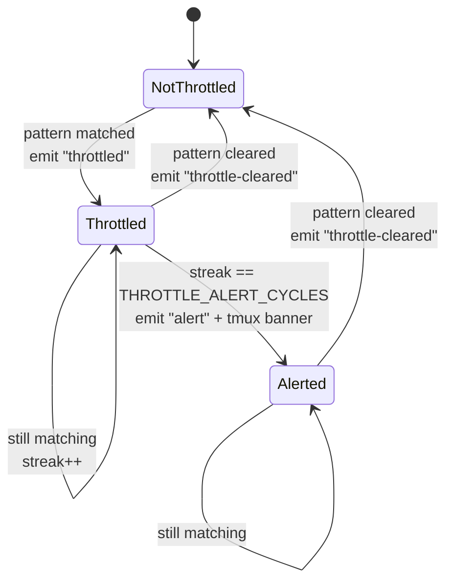

# Watchdog

The watchdog is a per-session monitor that lives inside the hidden `ae-monitor` tmux window. Its live loop is the Rust core's `_watchdog-run`, launched by the session's `watchdog` helper. It walks every registered agent pane on a fixed cycle, classifies each agent's state, and reacts: nudges idle agents, alerts on dead ones, pauses nudging when upstream rate limits are visible, and respects explicit completion signals.

The watchdog's live path is entirely in the Rust core. `_watchdog-run` owns the fixed
cycle, liveness decisions, alerts, nudges, pending session-id recovery, and Telegram
supervision.

## Lifecycle

- **On by default.** Created with the session, unless `workspace.watchdog = false` in config or the session meta says otherwise (`watchdog = false`). Explicit `false`/`no`/`off`/`0` disables it.
- **Manual control:** `~/.ae/sessions/<name>/watchdog start|stop|status` (alias: `loop`).
- **Persists across resume.** The state is recorded in session meta.
- **Repaired by publish.** An upgrade restarts a live watchdog on the new core and starts one
  that is missing from a running watchdog-enabled session. An explicitly disabled watchdog
  stays absent.
- **Self-terminates** if the tmux session or `meta` file disappears.

Each completed verdict cycle replaces one session-scoped `@ae_agents` value:
`v1;<epoch>;<interval_secs>;<name>:<profile>:<state>:<pane>;…`. It contains every
seat in the recorded roster's creation order, including missing panes as `dead`
with an empty pane hint, and excludes the monitor panes. Present seats reuse
that cycle's per-agent verdict and recorded profile; `interval_secs` is this
daemon's own cadence, not a reader default. The whole value is one bounded
atomic option write; an unrepresentable roster or cadence unsets it instead of
publishing a partial fact. `watchdog stop` also unsets it, so a stopped daemon
cannot leave the picker claiming a live roster snapshot.

On the quota cadence, and only there, the daemon also replaces one session-scoped `@ae_spend`
value: `v1;<epoch>;<interval_secs>;<usd_micro>;<flag>`, with `<flag>` one of `exact`, `partial` or
`approx`. It comes from one `usage::observe` pass over THIS session alone, priced from the same
config `ae usage` reads, which is why it rides `quota_every_secs` (default 300; `0` disables spend
too) instead of the verdict interval — one transcript pass per cadence, not per cycle. The
`interval_secs` it publishes is that cadence ROUNDED UP to whole verdict cycles, which is the period
the shared counter really lets through; the reader expires a fact after two of them, so advertising
the unrounded request would strand a healthy fact between samples. Any coverage
short of a fully read and fully priced session publishes `partial`, so a session ae cannot measure
never shows a confident zero. A failed or unrepresentable observation UNSETS the option, as does
`watchdog stop`, because the picker must read an absent fact as unavailable rather than current.

The `_watchdog` pane runs the core directly: its command is the session's `watchdog` link,
which is a symlink to the core binary under another name, dispatching to `_watchdog-run`.
There is no generated script or shell process between tmux and the core.

## Implementation: Rust core

The Rust core owns all liveness, stale, throttle, and quiet decisions, together with
their effects. A session's `watchdog` helper is one of the core symlinks generated at
launch; refreshing a session replaces the on-disk link, while a running watchdog keeps
the process it already has until it is stopped and started.

| Component | Runtime | Ownership |
|---|---|---|
| Rust core watchdog | `_watchdog-run` in the session's `_watchdog` pane | Per-cycle observation, quota-state advisories, liveness decisions, nudges, alerts, status publication, pending tool-session-id recovery, and Telegram supervision |

## Live Rust core loop

The sections below describe the Rust core's per-cycle state machine and effects.

## Tunables

| Variable | Default | Meaning |
|---|---|---|
| `AE_WATCHDOG_INTERVAL_SEC` | 60 | Cycle length in seconds |
| `AE_WATCHDOG_STALE_MIN` | 15 | Idle minutes before a nudge fires |
| `AE_WATCHDOG_MAX_NUDGES` | 2 | Nudges before escalating to alert |
| `AE_WATCHDOG_THROTTLE_ALERT_CYCLES` | 5 | Continuous throttle cycles before throttle-alert |
| `AE_WATCHDOG_TG_SUPERVISE_SEC` | 120 | Telegram-bridge revive cadence in seconds (`0` disables) |
| `AE_WATCHDOG_SWEEP_SEC` | 120 | Orchestrator changed-overview minimum-spacing fallback when persisted `sweep_sec` is absent or invalid (`0` falls back to the normal watchdog; positive values below `60` become `60`) |
| `AE_WATCHDOG_SWEEP_RETRY_SEC` | 30 | After an UNDELIVERED sweep nudge, retry this soon instead of waiting a full `AE_WATCHDOG_SWEEP_SEC` (clamped to it; floor — lands on the next poll) |
| `AE_WATCHDOG_SWEEP_RETRY_MAX` | 6 | Fast retries allowed before falling back to normal cadence and raising one `meta-agent unreachable` alert |

Set them in the shell before `ae <name>`, or via your shell rc.
For the orchestrator only, launch persists `[workspace] sweep` as `sweep_sec`;
that session fact outranks `AE_WATCHDOG_SWEEP_SEC`, which outranks 120.

Launch also persists `[workspace] quota_every_secs` (default 300, `0` disables) for every session.
The daemon rounds that cadence up to whole verdict cycles. One counter paces both readings this
cadence owns: the spend fact above, then the quota observation. Each due pass performs one bounded
`ae quota` observation, keeps state by canonical source, rollout, bucket, qualifier, and window,
then advises only the session's main and optional colead on threshold transitions. A refused paste
is retried once at the next quota observation; newer state, silence, expiry, or changed recipient
identity cancels the old booking. A helper's `UNCONFIRMED` submit counts as delivered because the
paste may have landed; only its explicit pre-submit-refusal marker permits a retry. No quota state
survives a watchdog restart.

Launch persists `[workspace] idle_nudge_secs` too (default 300, `0` disables).
This clock starts when the current Claude Code or Codex frame is positively
recognized as an empty input box. A Claude Code frame qualifies only when the
input box is framed by both borders and is followed by the status line (`🧠`)
and permission-mode footer (`⏵`). Other Claude setups, including default
permission mode or a missing status line, stay Unknown and keep the legacy
motion rule. An ambiguous frame pauses the idle verdict but preserves the
episode; only Busy, a declaration, or a human draft resets it. Pane hashes,
cursor animation, and redraws cannot re-arm its budget. The clock and delivery
counters ride in the watchdog-owned `@ae_observed` pane option, guarded by the
slot+agent identity, so a watchdog restart preserves an episode while a reused
pane id does not inherit it. The option also carries the latest applied
declaration fingerprint: each new declaration resets the idle clock and
reminder budget once, including across a watchdog restart.

For an orchestrator main, each verdict cycle calls `current_world` once and
builds the same detail cards as `ae brief --all`. The pure overview renderer
omits the orchestrator's own session and bounds data lines to 100 characters.
`NEEDS YOU` has one heading per session and includes only explicit
`waiting-user`/`blocked` declarations from that session's main or named
`colead`; worker declarations stay with their session leadership. Sessions and
their needs sort oldest first. Each need occupies at most twelve lines: after
the first identity-bearing line, continuation lines have a four-space indent
and a 96-character body. Word wrapping consumes at least half of each
non-final line, so even the worst split carries a full 600-character reason;
only text beyond that bound is ellipsized.
Unanswered asks/reviews never enter `NEEDS YOU`; their count is appended once to
the session's first `WORKING` row when nonzero. The renderer groups the remaining
facts under `WORKING` and `QUIET`. The watchdog hashes the semantic facts behind
that text and pastes it only when the last delivered hash differs and the minimum
spacing has elapsed. Elapsed age labels and request bodies never change the hash;
leadership state/reason or the per-session open-request count does. Unchanged
cycles never wake the model.

A main-seat `state working` declaration holds a changed overview for 600
seconds. During that hold there is no delivery attempt or booking: the
delivered hash and both spacing clocks remain unchanged, so the next cycle
retries the same overview. At 600 seconds the hold expires and delivery may
proceed, preventing a stuck `working` declaration from starving the human.
Other declarations and an idle seat never hold an overview.

`meta-agent-state.json` carries the watchdog heartbeat, semantic hash, the
oldest delivery awaiting acknowledgement, and the latest successful delivery
used for spacing. Both delivery clocks are captured after the checked submit;
repeated unacknowledged deliveries advance spacing but never slide the oldest
acknowledgement deadline. A restart therefore neither resends unchanged text,
forgets spacing, nor grants a fresh grace window. The file mtime is not seat
liveness: the main seat's newest `state done` event in `events.jsonl` must be at
or after the latest successful delivery before it acknowledges the batch. The
oldest outstanding delivery still owns the fixed deadline; no qualifying
`done` past `sweep * 2 + 60` seconds becomes `wedged`, and the next qualifying
`done` clears it. For an idle seat, the only action on the pasted turn is that
acknowledgement. If a human instruction is already in progress, the seat
finishes it before acknowledging; an overview is a notification, never a
replacement task. The seat never runs `ae brief --all` on a timer.

## Per-cycle state machine

Before walking panes, a due quota pass refreshes the session-local advisory state. The first sample
is silent. `headroom` is below 80%, `low` begins at 80%, and `critical` at 95%; downward hysteresis
leaves those states below 75% and 90% respectively. Unsupported, unreadable, truncated, unknown,
or older-than-60-minute rows are silent and drop prior state.

Per client scope the daemon holds ONE reading: the accepted observation, the policy it was judged
under, and the provenance of both. A newer observation replaces the row, a changed declaration or a
newer account fact re-judges the row already held, and an older observation is refused whatever
arrives with it. Everything a seat is then told — the notice, its booked provenance, and the quota
line appended to a throttle nudge — is rendered from that one reading, so a refused observation's
percentage or age never appears beside a level it did not decide.

For each agent pane, the watchdog walks a fixed branch order. First match wins; later branches don't fire.



The classifier reads only the same current 40-row `capture-pane` result the
watchdog already takes. It never opens a harness transcript or conversation
store. Claude Code and Codex have positive frame grammars; unsupported,
partial, modal, or ambiguous frames are `Unknown` and retain the legacy
hash/event heuristic.

In source order:

1. **Dead** — pane's foreground command is a shell AND no agent binary is in the descendant process tree. Alert once, mark dead, ignore in future cycles.
2. **Orchestrator main** — use overview-sweep accounting; no harness-idle reminder competes with it.
3. **Declared quiet state** — agent's latest relevant event is its own `state` declaration of `done`, `waiting-user`, or `blocked` (`mark-done`/`done` events count as `done`), AND no newer ae event mentions them as actor or target. `done` is skipped silently and is event-only (pane churn never revives it). `waiting-user`/`blocked` are also skipped, but yield to pane activity: if the pane changed since the declaration (e.g. the human replied directly in it, leaving no event), the quiet state no longer holds and the normal branches resume — so a post-reply hang is still caught.
4. **Throttled** — the current capture contains a known upstream rate-limit / overload phrase for the agent's binary. Skip nudge, emit `throttled` event first time per streak, escalate to `alert` after `THROTTLE_ALERT_CYCLES` continuous cycles.
5. **Busy frame** — positively recognized execution. Mark working, reset idle and reminder state, and clear a durable stale alert.
6. **Idle frame** — positively recognized empty input. Mark idle immediately; after `idle_nudge_secs`, send `you look idle: declare state or continue` through the existing `send` path. At the normal maximum, emit the same durable stale alert and keep it across daemon restarts until real Busy recovery.
   - **Outstanding own work DEFERS that reminder.** A seat with a request it SENT that nobody has answered, or an agent it SPAWNED that still holds a seat here, is not idle — it is the thing everybody else is waiting on. The empty input box is the right reading of the pixels and the wrong reading of the facts. Both are facts ae already owns: [`session::Outstanding`](../../src/session.rs) reads them from the pending-request sensor and the spawn/retire ledger, and nothing new is persisted, captured or published for them. Requests RECEIVED never count — answering one is the seat's own job.
   - The deferral is bounded on two clocks, whichever ends first: the idle episode reaching `(max_nudges + 1) x idle_nudge_secs`, which is the whole nudge budget's worth of deferred opportunities, or the oldest outstanding item passing `4 x idle_nudge_secs`. Past either, the seat spends its ORDINARY budget — the same nudges and the same durable alert — and each reminder names what ae thinks it is waiting on. Suppression is a DEFERRAL, never silence: a genuinely wedged lead is still caught, it is just caught later.
   - A seat is matched on its ROUTING KEY wherever the writer recorded one (`session::is_actor`, the same rule a declaration is matched by), and only on the display name for a legacy record that carries no key. A rename churns the name; it must not hand a seat somebody else's open work, nor lose its own.
   - A spawn defers only while its seat is actually HELD, decided on the cycle's own evidence: the Dead verdict does not hold, and the pane is not sitting at a bare shell — the two conjuncts `ae list` renders, so the publisher's decision and the human's explanation cannot disagree. A spawned tool that exited into its retained shell excuses nobody. UNKNOWN policy is two cases, not one rule, because the pane's foreground command is read first: a pane at a bare shell holds no seat whatever the snapshot says, so an uncertain snapshot never rescues it; a pane running a real tool keeps its seat when the snapshot cannot confirm the process, because the Dead verdict demands positive absence and a probe gap is not proof of death. That second deferral is retained rather than unbounded — the same two clocks end it.
   - `ae list` prints the same reason on the agent's line (`· waiting on 2 requests, 1 spawn`), so the human reads why a seat is quiet without opening its pane.
7. **Unknown frame** — run the legacy hash/event heuristic: changed or recently changed is active; a recent ae event is active; otherwise send the legacy status check, then alert at the same maximum.

After the per-pane pass:

8. **Missing pane check** — agents registered in `meta` whose tmux panes have vanished. Alert once each.
9. **Recover pending session ids** — retry codex/gemini/opencode post-launch session capture for slots still marked `pending`.

The list/brief attention reader treats the session's latest successful launch as
a recovery boundary: a durable watchdog alert older than `started=` no longer
contributes `attn:dead`, `attn:stale`, or `attn:throttled`. An alert at or
after that boundary still contributes normally, so a seat that dies after
relaunch is visible. Legacy metadata uses the newest `launch_time.main` or
`launch_time.worker.*` as the boundary; only sessions lacking both clock forms
keep the prior behavior.

## Quiet states and how they're invalidated

`_agent_quiet_reason` returns an agent's current quiet state (`done` / `waiting-user` / `blocked`) plus its declaration timestamp, or empty. It reads the *latest relevant event* for the agent: a `state` declaration (or a `mark-done`/`done` event, mapped to `done`) wins only if no newer event mentions the agent as actor or target. An inbound `send`/`ask`/`review`/`nudge` is newer → quiet state invalidated.

**`done` is event-only.** Pane hash changes, terminal resizes, scrollback churn — none of these revive a done agent. The historical "pane churn after done = agent kept working" heuristic was too noisy and was removed. Trade-off: silent work after `done` (output without ae helpers) is invisible to the watchdog. Acceptable — ae already requires helper discipline; a resuming agent should emit an ae event.

**`waiting-user` / `blocked` yield to pane activity.** These states mean the agent is parked, but the unblocking input often arrives as the human typing *directly in the pane* — which produces no `events.jsonl` entry, only a pane-hash change. The watchdog keeps a per-pane **quiet baseline** (`_quiet_pane_decision`): the first cycle that observes a declaration *arms* the baseline with the current pane hash — already including the declaration's own echo, since the `state` helper prints to the pane — and honors the quiet state. Subsequent cycles *hold* (suppress nudges) while the hash equals that baseline. One differing capture re-arms the baseline and still holds, so a focus repaint or resize settles without waking the agent; the state *yields* only when the pane keeps changing for two cycles (human reply / agent output), at which point the normal active/recent/stale branches resume. Baselining on the echoed hash is essential: a naive "no pane change since the declaration timestamp" check would be tripped by the echo itself and never suppress a single nudge.

Concretely:

- Agent emits `state blocked "Codex review blocks merge; lead unblocks req-Z. I ran local tests and recorded failures in .local/review.md."` → state event in `events.jsonl`.
- The watchdog skips it each cycle while the pane is quiet (step 2 fires).
- Human types unblock info in the pane → pane hash keeps diverging from the re-armed baseline for two cycles → `_quiet_pane_decision` yields → normal state machine resumes; if the agent then hangs, it gets nudged.
- Or another agent sends it a message → newer event → quiet invalidated the same way.

### `done` dual-emit

`state done` (and its `mark-done` alias) emit both a `state ref=done` event and an `action=done` event; the watchdog reads either, so a watchdog process started before the `state` helper still recognizes completions.

## Throttle detection

Tool-specific patterns inside the watchdog body. Narrow phrases only — false positives compound badly.

| Tool | Patterns |
|---|---|
| `claude` | `Server is temporarily limiting requests`, `API Error: Overloaded`, `Anthropic API error` |
| `codex` | `Rate limit exceeded`, `RateLimitError`, `ratelimit_exceeded` |
| `gemini` | `RESOURCE_EXHAUSTED`, `Quota exceeded` |
| `opencode` | Union of the three above (TUI wraps configurable providers) |
| generic | `429 Too Many Requests`, `503 Service Unavailable` |

When detected:

1. Skip the nudge. Reset nudge counter (so a previously stale agent's count doesn't carry over).
2. First detection of a streak → emit `throttled` event.
3. After `THROTTLE_ALERT_CYCLES` consecutive throttled cycles → emit `alert` event + tmux banner. Once.
4. When the pattern no longer matches → emit `throttle-cleared` event, reset streak.

On the first throttle event only, the watchdog may append the worst row from its last scheduled
quota observation. The source must exactly match the seat's recorded config-home mode/base; Codex
also requires the recorded rollout id. Missing or legacy identity, another rollout, and expired or
silent rows leave the existing throttle event unchanged. This lookup uses the uncapped observation
and never reads a vendor cache from the throttle path.

The streak state per pane is a small machine:



There is no repeat-alert. Once an agent has been alerted for a streak, it stays in `Alerted` silently until the pattern clears. This is deliberate — paging once per streak is informative; paging every minute would be spam.

## What the watchdog cannot do

- **Restart a dead agent.** Marks it dead and stops checking.
- **Detect CLI-internal hangs that produce no pane output.** The dead-check only fires when the foreground command drops to a shell.
- **Push notifications externally.** Alerts are tmux banners + `events.jsonl` entries. Passive.
- **Prove progress inside a long-lived Busy frame.** A stuck spinner still looks Busy; unsupported
  or ambiguous harness frames keep the conservative legacy hash/event fallback.

For overnight runs, pair the watchdog with an external tail process on `events.jsonl` if you actually need to be paged:

```sh
tail -F ~/.ae/sessions/<name>/events.jsonl \
  | grep --line-buffered '"action":"alert"' \
  | xargs -L1 -I{} <your-pager-cmd>
```

## Inspection

```sh
~/.ae/sessions/<name>/watchdog status         # is the watchdog running?
~/.ae/sessions/<name>/peek _watchdog 60       # last 60 lines of decisions
~/.ae/sessions/<name>/peek _events 60     # event stream
```

Or via tmux directly: `Ctrl+b w`, pick `ae-monitor`.
