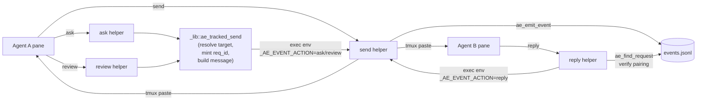

# Session helpers

Every ae session has a directory at `~/.ae/sessions/<name>/` filled with generated bash scripts. Agents call them by absolute path (they're deliberately not on `PATH`); humans can too. All helpers regenerate from the running ae binary on every start, resume, and `ae doctor --refresh`.

## Communication

| Helper | Purpose |
|---|---|
| `send <agent> <message>` | Deliver a message to another agent's pane (serialized with flock). Refuses a dead pane, waits out a busy or human-occupied input, pastes, and verifies the submit — see [How `send` delivers](#how-send-delivers). |
| `ask <agent> <question>` | Tracked request — embeds your identity and an exact reply command with a request id. |
| `review <agent> <request>` | Like `ask`, but with the critical-review prompt template (findings-first, BLOCKER/IMPORTANT/NIT). |
| `reply <request-id> <message>` | Reply to a logged `ask` / `review` by request id. Verified against the request's stored **slot** (the routing key), not the display name; `--as <agent>` sets the displayed sender only and cannot bypass that check. |
| `requests [mine\|inbox\|all]` | Inspect pending / replied state from `events.jsonl` without peeking panes. |
| `say <text>` | Push a free-text line to the human's Telegram chat (args or piped stdin). Emits a `chat` event the [Telegram bridge](telegram.md) forwards; a Telegram reply routes back to you. Pane output is not forwarded — this is how you answer the human on Telegram. |

All messaging helpers emit a structured event into `events.jsonl` so the morning-after view stays auditable.

### How they compose

`ask` and `review` are thin wrappers over the shared `ae_tracked_send` in `_lib`. Everything ultimately dispatches through `send`, which is the only helper that actually pastes into a pane. `reply` looks up the original request via `ae_find_request` (also in `_lib`) before delegating to `send`.



Only one helper touches tmux (`send`). Only one path mints request ids (`ae_tracked_send`). Only one helper validates reply pairing (`ae_find_request`). That symmetry is why the surface is auditable in `events.jsonl` — every interaction passes through the same emit point.

### How `send` delivers

`send` protects the target pane and confirms delivery, then reports loudly if it can't — it never drops a message silently:

1. **Dead-pane refusal.** If the target agent has exited and its pane fell back to a shell, `send` refuses — a stray Enter would run the message as a shell command. Nothing is pasted:
   `ae: send to <target> REFUSED — target pane is a shell, not a running agent …`
2. **Busy / human-input defer.** For a modelled TUI (claude, codex) `send` waits while the input box is non-empty, mid-generation, or unreadable — fail-closed, so it never clips a half-typed human question or pastes into a busy prompt. It retries for ~2s (5 × 0.4s); if the input never clears it abandons rather than clobbering:
   `ae: send to <target> ABANDONED — target has unsent/human input or is busy …`
3. **Submit verification.** After pasting, `send` confirms the text left the input box, nudging Enter up to twice more. If it still can't confirm, it fails loudly:
   `ae: send to <target> UNCONFIRMED — submit not verified. Re-send.`
4. **No durable outbox.** ae is not a queue — a loud failure is the signal for the sender to re-send. `ask` / `review` / `reply` / `interrupt` all deliver through this same path and inherit every guard.

Other tools (gemini, opencode, plain shells) receive without the modelled busy / human-input protection — only claude and codex expose a reliable input-state read.

### Slot identity

Every agent pane carries a stable **slot** — `main`, `worker.<n>`, or `spawned.<n>` — stamped as the `@ae_slot` tmux pane option and recorded in the session meta. The slot is the **routing key**: requests and replies are addressed and verified by slot + session, so a reply reaches the right agent even after its display name (`@ae_agent`) changes. The name is display only. `reply` checks the sender's live slot against the request's stored slot before delivering; a name passed with `--as` is shown but never trusted for routing. Live sessions that predate slot stamping get their `@ae_slot` filled in on the next `ae doctor --refresh` or resume.

## State

| Helper | Purpose |
|---|---|
| `mark-done [message]` | Signal completion / pause. The watchdog stops nudging until a newer ae event mentions the agent. |
| `memo add [--topic t] <text>` | Append to durable shared session memory. |
| `memo read [--topic t]` | Read shared memory. |
| `memo tail [n]` | Show latest entries. |
| `goal [text\|--clear]` | The session's one-line objective — what this session is *for*. No args prints it. Shows in `ae list` (table sub-line and JSON `goal` field), survives resume, and the watchdog quotes it when nudging idle agents. Emits a `goal` event on set/clear. |

`memo` is the right place for findings, decisions, and handoffs that should survive agent restarts. Don't dump chat transcripts.

## Inspection

| Helper | Purpose |
|---|---|
| `peek <agent> [lines]` | Capture recent output from another agent's pane (default 80, max 2000). Inspection only — never a reply mechanism. |
| `peak <agent> [lines]` | Alias for `peek` (common typo). |
| `agents` | List session agents with pane ids and current process. |
| `agents --all` | List agents across every running ae session. |

## Lifecycle

| Helper | Purpose |
|---|---|
| `focus <agent>` | Switch tmux focus to another pane. |
| `interrupt <agent> [message]` | Cancel current generation, optionally send a replacement instruction. |
| `spawn <alias:name> [prompt]` | Add a new agent to the workspace, in its own tmux window named after its role. Always pass a descriptive role name. |
| `retire <agent>` | Remove a spawned agent — kills its pane (and window), cleans meta incl. launch bookkeeping, updates `workspace.md`. |

## Internal

Helpers prefixed `_` are launched by ae itself, not by you or by other agents.

- `_register-sid` — Codex self-registers its session UUID on launch (so ae can resume the exact conversation later).
- `_watchdog` / `_events` (pane tags, not scripts) — the panes inside the `ae-monitor` window.

## Name resolution

Every helper that takes an agent argument resolves it flexibly:

- `codex:reviewer` — exact match (alias + name).
- `codex` — alias only, when unique in the session.
- `reviewer` — bare name, when unique.
- `%42` — raw tmux pane id.
- `@other-session:codex:reviewer` — cross-session.

## Cross-session

Prefix any target with `@<session>:` to reach an agent in a different ae session:

```bash
~/.ae/sessions/<your-session>/send @other-feature:claude:lead "check my API changes"
~/.ae/sessions/<your-session>/peek @other-feature:reviewer 50
~/.ae/sessions/<your-session>/agents --all
```

The receiving agent gets the message exactly as if it came from a same-session sender.

## Reply contract

When an agent receives an `ask` / `review` request, the message includes the exact reply command they MUST run when done:

```text
REQUEST ae-20260518T064807Z-bedad2f3 from claude:lead: <your question>

REQUIRED: When you have finished, you MUST run this exact command to reply:
/home/ckriech/.ae/sessions/<name>/reply --as "codex:coworker" "ae-2026..." "<your reply>"
Do not reply any other way. Do NOT use peek/peak as a reply mechanism.
```

Agents are instructed to run that command verbatim. If they do, `requests` picks up the pending → replied transition automatically.
